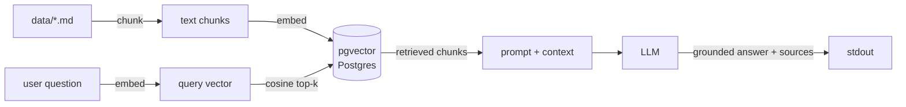

# rag-demo — a minimal, working RAG pipeline

[](https://github.com/augbastos/rag-demo/actions/workflows/tests.yml)
[](LICENSE)

A small, self-contained Retrieval-Augmented Generation pipeline you can clone and run in a few minutes. It's the same technique behind a production doc-grounded copilot I built ("ask a question, get an answer grounded in a knowledge base, with citations") — stripped down to its essentials on a generic sample dataset.

The point isn't the sample data. It's to show the moving parts of RAG working end-to-end, in code you can read start to finish in about five minutes: chunking, embeddings, a `pgvector` similarity index, a retrieval query, and a grounded LLM answer that refuses to make things up.

## How it works



| Stage | What it does | Where |
|---|---|---|
| **Chunk** | Docs split into overlapping windows (600 chars, 100 overlap), preferring paragraph/sentence breaks over mid-word cuts | `common.py:chunk_text` |
| **Embed** | Local `sentence-transformers` model (`all-MiniLM-L6-v2`, 384-dim), no API key needed to index | `common.py:embed` |
| **Store** | Postgres + `pgvector`, cosine distance, an IVFFlat index, and a `match_chunks()` SQL function — the same shape you'd deploy as a Supabase RPC | `schema.sql` |
| **Retrieve** | Top-4 nearest chunks to the question by cosine similarity | `ask.py:retrieve` |
| **Generate** | The retrieved chunks are the *only* context the LLM may answer from; if the answer isn't in them, it says so, and cites the source doc | `ask.py:answer` |

## Run it

```bash
# 1. Postgres + pgvector (Docker)
docker compose up -d
psql "$DATABASE_URL" -f schema.sql        # or: make up && make schema

# 2. Python deps
pip install -r requirements.txt
cp .env.example .env                        # set LLM_API_KEY for the answer step

# 3. Index the sample knowledge base, then ask
python ingest.py
python ask.py "How do I export my notes?"
```

Example:

```
$ python ask.py "Can I use Nimbus offline?"
Yes. Nimbus keeps a local-first copy of every note, so you can read and edit
completely offline; changes sync automatically when you reconnect. [nimbus-faq.md]
```

No `LLM_API_KEY`? `ask.py` doesn't crash — it prints the top retrieved chunk instead, so retrieval is always demonstrable even without a key.

Swap the files in `data/` for your own and re-run `ingest.py` — the pipeline is domain-agnostic. Note: `ingest.py` truncates and reindexes on every run, it's not additive.

## What's non-trivial here

This is deliberately small, but a few choices are the actual engineering, not boilerplate:

- **Grounded, not generative-from-memory.** The system prompt hard-limits the model to retrieved context and instructs it to say "I don't know from the docs" when the context doesn't cover the question — the single most important guard against a doc copilot hallucinating.
- **Chunking with paragraph/sentence-aware cuts.** Fixed-size windows are the naive approach; `chunk_text()` looks for the nearest blank line or sentence end before falling back to a hard cut, so retrieval lands on coherent passages instead of severed sentences.
- **Retrieval correctness is unit-testable without a database.** `tests/test_rag.py` includes a pure vector-math test (`test_retrieval_ranks_relevant_chunk_first`) that embeds three sentences and asserts cosine similarity ranks the actually-relevant one first — a sanity check on the embedding model's behavior that runs in CI with zero infrastructure.
- **Local embeddings, hosted generation.** Embedding every chunk through a paid API gets expensive and slow at index time; a local model keeps ingestion free and lets the whole pipeline run without any key until the final answer step.
- **`pgvector` over a bespoke vector DB.** One database for rows *and* vectors means one backup, one connection, one RLS policy — and it ports straight to Supabase.

**Known limitation, stated honestly:** pure cosine-vector retrieval misses exact-match terms (product names, commands, IDs) because embeddings optimize for semantic similarity, not lexical overlap. Out of scope here to keep this demo to four files — the first thing to add for a corpus with more proper-noun/SKU-style content would be hybrid keyword+vector search or a reranking pass.

## Repo layout

```
common.py      # shared: DB connection, embeddings, chunking
ingest.py      # chunk + embed data/*.md, load into pgvector
ask.py         # embed a question, retrieve top-k, generate a grounded answer
schema.sql     # pgvector table + IVFFlat index + match_chunks() function
docker-compose.yml  # local Postgres + pgvector
tests/test_rag.py   # offline unit tests: chunking, embeddings, retrieval ranking
data/*.md      # fictional sample knowledge base ("Nimbus")
```

Four files for the pipeline itself, by design — this is meant to be read in one sitting, not a framework.

## Testing

```bash
pytest -q     # or: make test
```

Four unit tests, all offline — no database, no API key. They cover chunking coverage with overlap, embedding normalization, and that pure-vector cosine similarity ranks the relevant chunk first. CI (`.github/workflows/tests.yml`) runs the same suite on every push with zero secrets configured.

## What's not built (yet)

Honest scope line: there's no automated retrieval-quality eval (e.g. `recall@k` against a golden query set) wired into CI yet — right now, "did this change to chunk size or `TOP_K` help or hurt retrieval" is answered by manually running `ask.py` a few times. That's the next thing worth adding to this repo, not a claim already made by it.

## Design notes

- **IVFFlat, not HNSW.** The index is explicitly tuned for a small demo corpus (`lists = 10`); past a few hundred thousand chunks this would move to HNSW for better recall/latency at scale.
- **Overlap over disjoint chunks.** The 100-char overlap between windows means a fact split across a chunk boundary is still likely to appear whole in at least one chunk.
- **`match_chunks()` as a SQL function, not inline queries.** Keeping the top-k lookup in Postgres itself (rather than in Python) is the same shape you'd expose as a Supabase RPC — no query logic to port later.

## Stack

`Python` · `pgvector` / `Postgres` · `sentence-transformers` · `Gemini` (swappable) · `pytest`

MIT licensed. Sample data is fictional.
