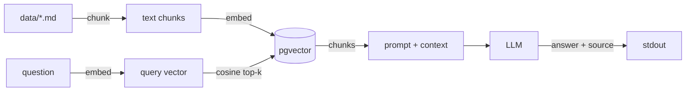

# rag-demo

A minimal Retrieval-Augmented Generation pipeline, readable end to end in about five minutes.

[](https://github.com/augbastos/rag-demo/actions/workflows/tests.yml)
[](LICENSE)

Four files, no framework: chunk a doc set, embed it, store it in `pgvector`, retrieve the top matches for a question, and answer grounded only in what was retrieved — with a citation. If the retrieved chunks don't cover the question, it says so instead of making something up. The sample knowledge base ("Nimbus") is fictional.

## How it works


```mermaid
flowchart LR
    A[data/*.md] -->|chunk| B[text chunks]
    B -->|embed| C[(pgvector)]
    Q[question] -->|embed| D[query vector]
    D -->|cosine top-k| C
    C -->|chunks| E[prompt + context]
    E --> F[LLM]
    F -->|answer + source| G[stdout]
```

## Run it

```bash
docker compose up -d
psql "$DATABASE_URL" -f schema.sql

pip install -r requirements.txt
cp .env.example .env        # set LLM_API_KEY

python ingest.py
python ask.py "Can I use Nimbus offline?"
```

## Files

| File | What it does |
|---|---|
| `common.py` | DB connection, embeddings, chunking |
| `ingest.py` | Chunk + embed `data/*.md`, load into pgvector |
| `ask.py` | Embed a question, retrieve top-k, answer grounded in the retrieved chunks |
| `schema.sql` | pgvector table, index, `match_chunks()` |

## License

MIT.
